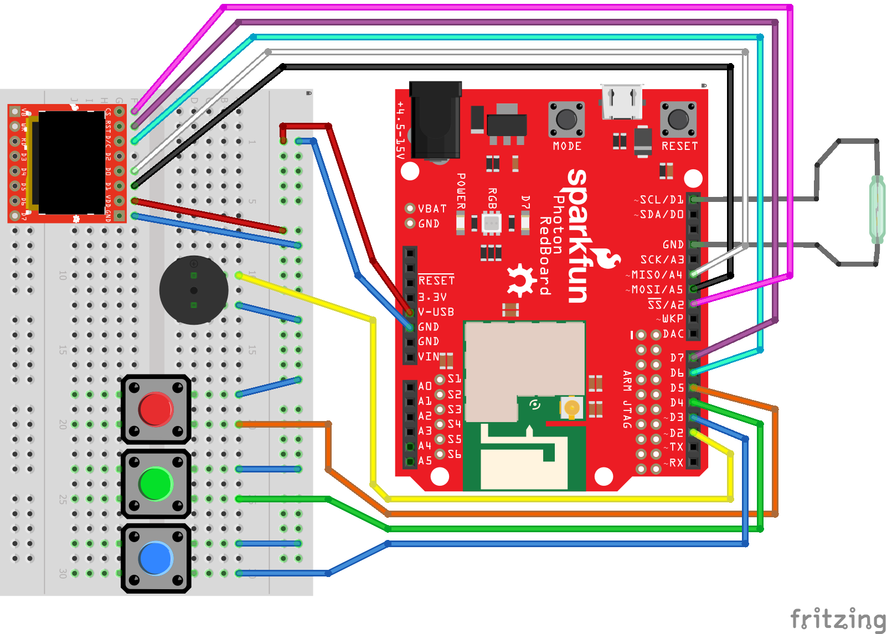

# AlarmSystem_JNI

[![Contributors][contributors-shield]][contributors-url]
[![Forks][forks-shield]][forks-url]
[![Stargazers][stars-shield]][stars-url]
[![Issues][issues-shield]][issues-url]
[![MIT License][license-shield]][license-url]

# AlarmSystem_JNI
Leistungnachweis Nr. 3 - Alarm System for Sparkfun Inventor's Kit for Photon using the OLED Display

## Hardware Components
This project uses:
- SparkFun Photon RedBoard
- Jumper Wires
- SparkFun Micro OLED Breakout
- Magnetic Door Switch Set
- Red, Blue and Green Button
- Piezo Speaker

# Getting Started

- Hook up your circuit as shown in the Hookup Diagramm
- download the file `Alarmsytem.c` (Software)
- Flash Your Code to the Photon

# Hookup Diagramm

# Additional Resources
See `docs` for Additional Information 

[contributors-shield]: https://img.shields.io/github/contributors/bbz-hft-software-engineering/AlarmSystem_JNI.svg?style=for-the-badge
[contributors-url]: https://github.com/bbz-hft-software-engineering/AlarmSystem_JNI/graphs/contributors
[forks-shield]: https://img.shields.io/github/forks/bbz-hft-software-engineering/AlarmSystem_JNI.svg?style=for-the-badge
[forks-url]: https://github.com/bbz-hft-software-engineering/AlarmSystem_JNI/network/members
[stars-shield]: https://img.shields.io/github/stars/bbz-hft-software-engineering/AlarmSystem_JNI.svg?style=for-the-badge
[stars-url]: https://github.com/bbz-hft-software-engineering/AlarmSystem_JNI/stargazers
[issues-shield]: https://img.shields.io/github/issues/bbz-hft-software-engineering/AlarmSystem_JNI.svg?style=for-the-badge
[issues-url]: https://github.com/bbz-hft-software-engineering/AlarmSystem_JNI/issues
[license-shield]: https://img.shields.io/github/license/bbz-hft-software-engineering/AlarmSystem_JNI.svg?style=for-the-badge
[license-url]: https://github.com/bbz-hft-software-engineering/AlarmSystem_JNI/LICENSE.txt
