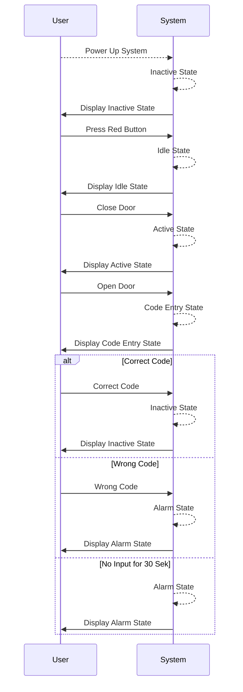

```mermaid
sequenceDiagram
    User-->>System: Power Up System
    System-->>System: Inactive State
    System->>User: Display Inactive State
    User->>System: Press Red Button
    System-->>System: Idle State
    System->>User: Display Idle State
    User->>System: Close Door
    System-->>System: Active State
    System->>User: Display Active State
    User->>System: Open Door
    System-->>System: Code Entry State
    System->>User: Display Code Entry State
    alt Correct Code
        User->>System: Correct Code
        System-->>System: Inactive State
        System->>User: Display Inactive State
    else Wrong Code
        User->>System: Wrong Code
        System-->>System: Alarm State
        System->>User: Display Alarm State
    else No Input for 30 Sek
        System-->>System: Alarm State
        System->>User: Display Alarm State
    end

```
