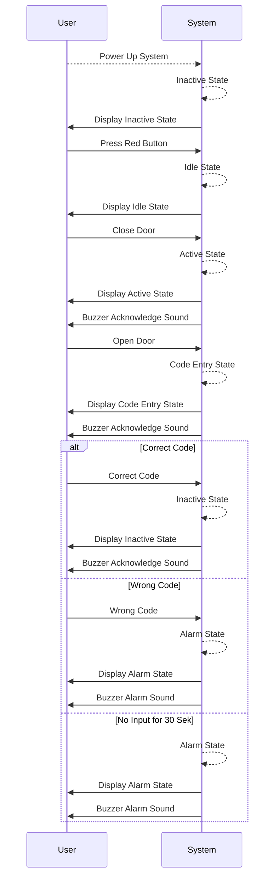
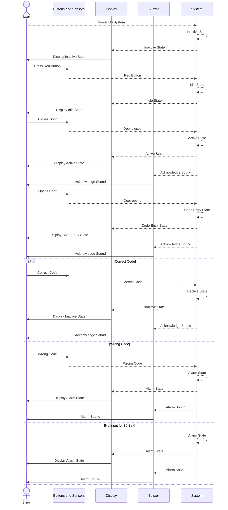

# Simple Diagram

```mermaid
sequenceDiagram
    User-->>System: Power Up System
    System-->>System: Inactive State
    System->>User: Display Inactive State
    User->>System: Press Red Button
    System-->>System: Idle State
    System->>User: Display Idle State
    User->>System: Close Door
    System-->>System: Active State
    System->>User: Display Active State
    System->>User: Buzzer Acknowledge Sound
    User->>System: Open Door
    System-->>System: Code Entry State
    System->>User: Display Code Entry State
    System->>User: Buzzer Acknowledge Sound
    alt Correct Code
        User->>System: Correct Code
        System-->>System: Inactive State
        System->>User: Display Inactive State
        System->>User: Buzzer Acknowledge Sound
    else Wrong Code
        User->>System: Wrong Code
        System-->>System: Alarm State
        System->>User: Display Alarm State
        System->>User: Buzzer Alarm Sound
    else No Input for 30 Sek
        System-->>System: Alarm State
        System->>User: Display Alarm State
        System->>User: Buzzer Alarm Sound
    end

```

# Complex Diagram

```mermaid
sequenceDiagram
    actor User
    participant Buttons and Sensors
    participant Display
    participant Buzzer
    participant System


    User-->>System: Power Up System
    System-->>System: Inactive State
    System-->>Display: Inactive State
    Display->>User: Display Inactive State
    User->>Buttons and Sensors: Press Red Button
    Buttons and Sensors-->>System: Red Button
    System-->>System: Idle State
    System-->>Display: Idle State
    Display->>User: Display Idle State
    User->>Buttons and Sensors: Closes Door
    Buttons and Sensors-->>System: Door closed
    System-->>System: Active State
    System-->>Display: Active State
    Display->>User: Display Active State
    System-->>Buzzer: Acknowledge Sound
    Buzzer->>User: Acknowledge Sound
    User->>Buttons and Sensors: Opens Door
    Buttons and Sensors-->>System: Door opend
    System-->>System: Code Entry State
    System-->>Display: Code Entry State
    Display->>User: Display Code Entry State
    System-->>Buzzer: Acknowledge Sound
    Buzzer->>User: Acknowledge Sound
    alt Correct Code
        User->>Buttons and Sensors: Correct Code
        Buttons and Sensors-->>System: Correct Code
        System-->>System: Inactive State
        System-->>Display: Inactive State
        Display->>User: Display Inactive State
        System-->>Buzzer: Acknowledge Sound
        Buzzer->>User: Acknowledge Sound
    else Wrong Code
        User->>Buttons and Sensors: Wrong Code
        Buttons and Sensors-->>System: Wrong Code
        System-->>System: Alarm State
        System-->>Display: Alarm State
        Display->>User: Display Alarm State
        System-->>Buzzer: Alarm Sound
        Buzzer->>User: Alarm Sound
    else No Input for 30 Sek
        System-->>System: Alarm State
        System-->>Display: Alarm State
        Display->>User: Display Alarm State
        System-->>Buzzer: Alarm Sound
        Buzzer->>User: Alarm Sound
    end

```
